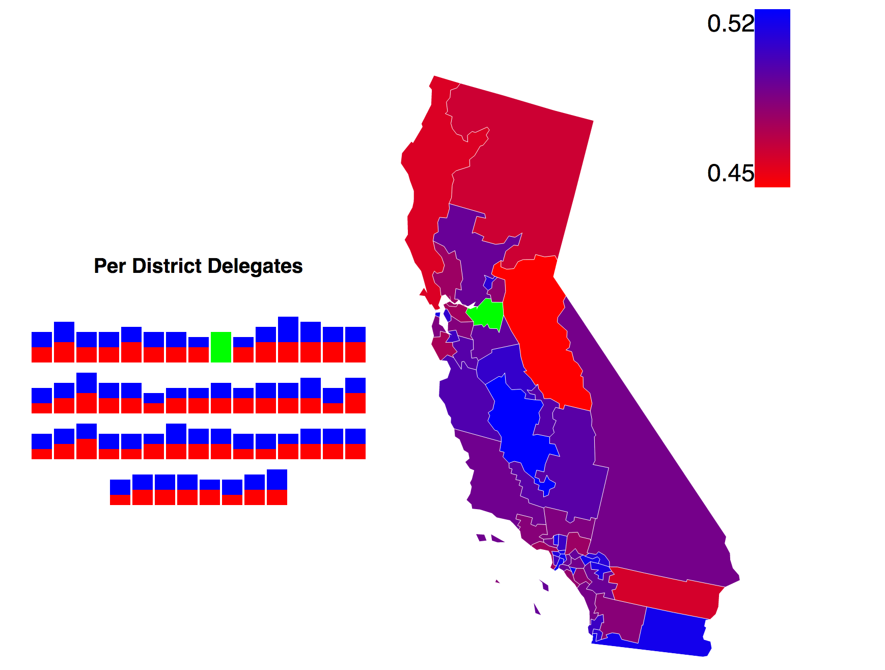

To checkout the project follow the link:
<a href="https://enigmatic-bayou-53008.herokuapp.com/">Voting Application</a>

The voting application was built to predict the California Primaries, testing each district for its lean towards Bernie Sanders or Hillary Clinton. The application uses census-data to thoroughly understand the breakdown of each district, whether it is regarding race, age, median income, and a variety of different options. The application even predicts how many delegates will side between the two delegates. 

### Using Models

The top bar of cubes represents the amount of representatives being split between the two candidates. There are four models to choose from: Gender, Race, Age, and Combined. Each model uses the provided census data for this division to predict the outcome of each district. Dark bue represents a district leaning towards Bernie Sanders, while red represents a district leaning towards Hilary Clinton. Using D3.js, the user can hover over the district or the boxes under "Per District Delegates" to see the break down of that district and how many delegates are located in that particular district. 

<figure>
	
</figure>

### Using Census Data

<figure>
	
	<figcaption>Breakdown for Median household income</figcaption>
</figure>