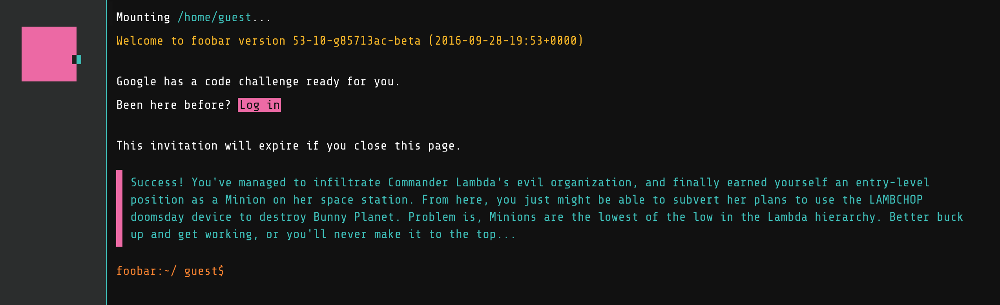

## Testing

About a month ago, I got a strange message after some search queries. My lack of understanding of Python iterators led me to a message popping up on my screen, asking if I was interested in a challege. 

<figure>
	
</figure>

The infamous foo bar challenge, a collection of challenges that are used as a way of finding employees. I am currently on level three of the challenge, and will update repeatedly as my progress continues. I will post solutions once I am able to submit my answers after level four, but if you are interested in some of the problems (and solutions) feel free to email me. 