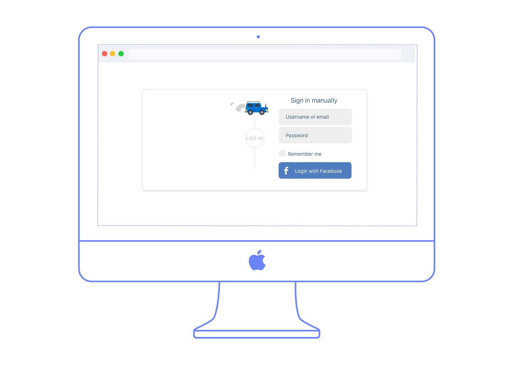
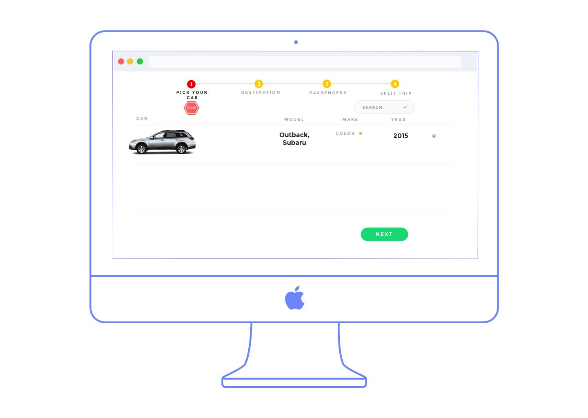
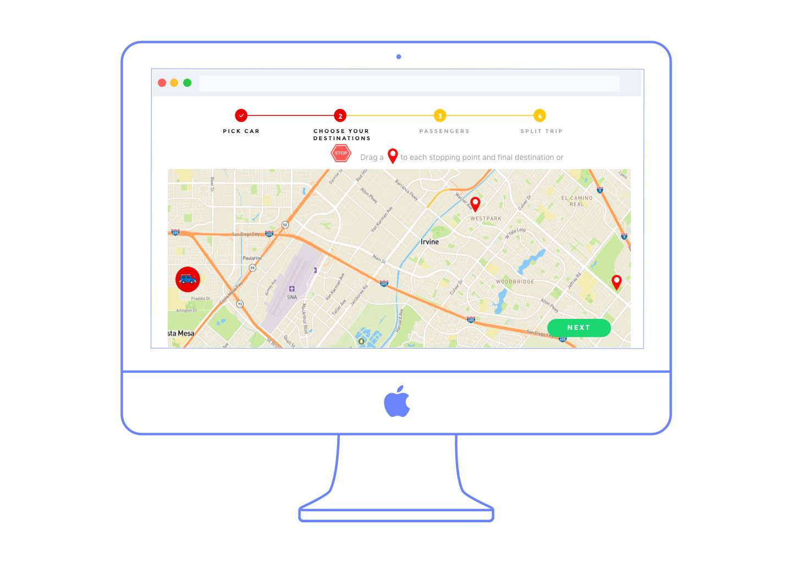
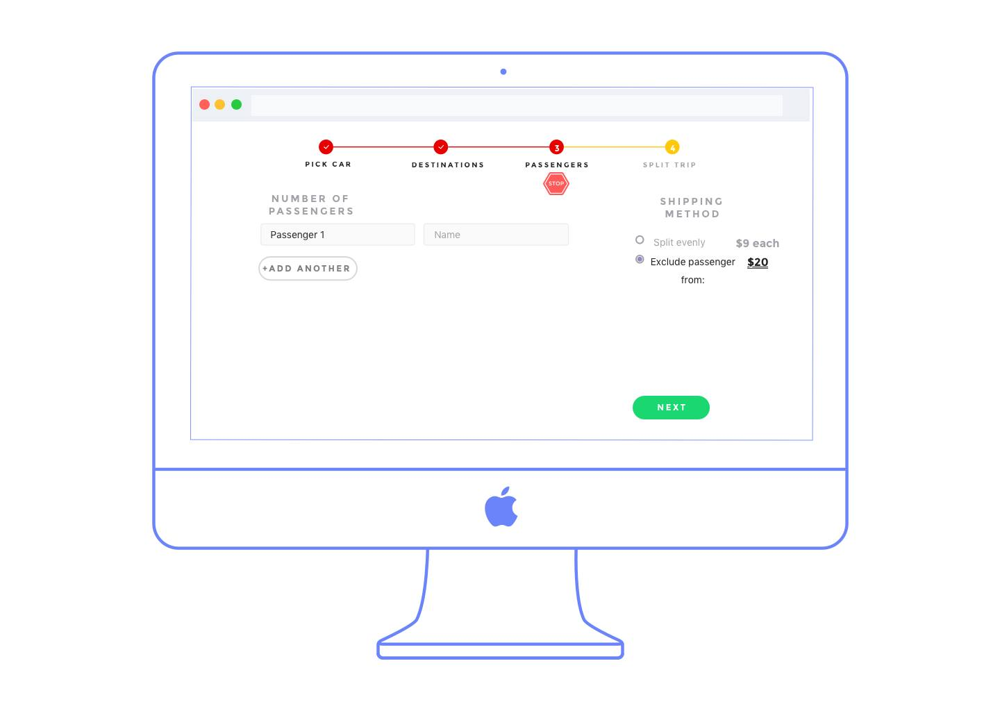

Trip Split is an application built for travellers. Ones who like to pack a car up with people and just drive out to a chosen destination with no plan in mind. This idea came about after coming upon the simple problem of gas division. We've noticed that either the driver or the passengers get an unfair trade for the amount they pay when dividing up the gas prices. Now, we could have whipped out a calculator and figured out exact distances, but our lazy nature and belief in approximation never lead us to be so exact. Until now. 

### Premise

The vision of Trip Split is to have a simple to use application to divide up gas for your road trip. You will import the cars you drive and find the people you take with, while being able to charge them after the trip through a Venmo payment. Further down the road, the app will have recommendations for cheaper places to get gas as well as recommendations to stop. 

### UI Design

<figure>
	
	
</figure>

The application will be intuitive and easy to use, with a very simple design aesthetic. The user will sign up and will be lead to starting a new "split", through which they will be selecting the car of their choice. Currently, the application uses AJAX to create live search functionality for the user, which queries a RESTful API of automobiles that range from now the 1980's to now. The API was built using the Django-Rest-Framework. 

<figure>
	
</figure>

Now, the user will enter in their source and final destinations, which will be visible through the Google Maps API. We will take average local gas prices from the source area to calculate the amount of gas one will spend for their journey. While this does make an assumption that the user will fill up before leaving, the estimation should be fairly exact. We plan to expand to an actual application that will keep track of the miles driven. 

<figure>
	
</figure>

Once the destination is chosen, the user will incorporate other passengers, who will be requested a payment through the Venmo API. This way, the user can easily charge people for the journey without leaving the application. 